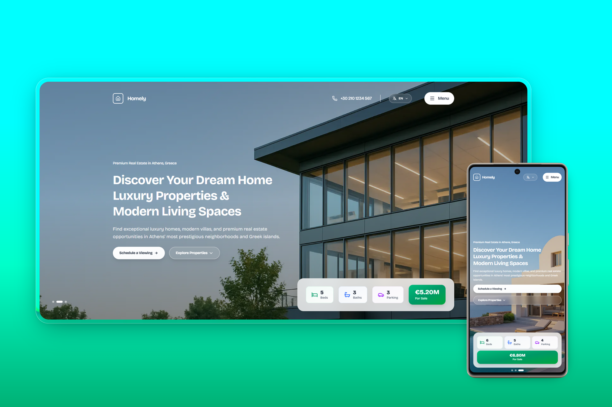

<div align="center">
  <h1>🏡 Spiti - Premium Real Estate</h1>
  <p><strong>Discover Your Dream Home with Luxury Properties in Athens</strong></p>
  
  
  
  
  
  
</div>

<div align="center">
  
  <p><em>Desktop & Mobile views: Hero carousel, property listings, dark mode, and responsive design</em></p>
</div>

---

## ✨ Overview

**Spiti** is a modern, luxury real estate platform for discovering dream homes in Athens and Greek islands. Combining premium design with cutting-edge technology.

**Key Features:**
- 🌓 Dark/Light mode toggle with system preference
- 🎨 Premium design with glassmorphism effects
- 🌍 Multilingual support (EN, ES, FR, EL)
- 📱 Fully responsive across all devices
- ⚡ Optimized performance with Next.js
- 🎬 Smooth animations with Framer Motion
- 🖼️ Auto-rotating hero carousel
- 🏠 Redesigned property cards with hover effects
- 🔍 Advanced search & filter system
- 📄 Dedicated pages: Home, Properties, About, Contact

---

## 🛠️ Tech Stack

| Technology | Version |
|------------|---------|
| Next.js | 16.0.0 |
| React | 19.2.0 |
| TypeScript | 5.x |
| Tailwind CSS | 4.x |
| Framer Motion | 12.23.24 |
| Lenis | 1.3.13 |

---

## 🚀 Quick Start

### Prerequisites
```bash
Node.js >= 18.0.0
npm >= 9.0.0
```

### Installation
```bash
# Clone repository
git clone <repository-url>
cd Spiti-Mou

# Install dependencies
npm install

# Run development server
npm run dev

# Open in browser
# http://localhost:3000
```

### Production Build
```bash
npm run build
npm start
```

---

## 🌐 Deployment

### Vercel (Recommended)
```bash
npm i -g vercel
vercel --prod
```

### Netlify
```bash
# Auto-detects Next.js
# Connect your Git repository
```

### Docker
```dockerfile
FROM node:18-alpine
WORKDIR /app
COPY package*.json ./
RUN npm ci
COPY . .
RUN npm run build
CMD ["npm", "start"]
```

---

## 🌍 Localization

Full support for 4 languages:

| Language | Code |
|----------|------|
| 🇬🇧 English | `en` |
| 🇪🇸 Español | `es` |
| 🇫🇷 Français | `fr` |
| 🇬🇷 Ελληνικά | `el` |

---

## 🎨 Design Highlights

- **Dark/Light Mode**: Seamless theme switching with localStorage persistence
- **Hero Carousel**: Auto-rotating backgrounds with smooth transitions
- **Glassmorphism**: Translucent cards with blur effects
- **Property Cards**: Modern design with badges, ratings, and hover effects
- **Custom Scrollbar**: Emerald gradient with smooth tracking
- **Search & Filters**: Advanced filtering sidebar on Properties page
- **Responsive Grid**: Adaptive layouts for all screen sizes
- **Hover Effects**: Interactive elements with scale and glow animations
- **Contact Form**: Animated submit with success feedback

---

## ⚡ Performance

- **Image Optimization**: AVIF & WebP support
- **Code Splitting**: Dynamic imports
- **Lazy Loading**: Images below fold
- **Font Optimization**: Display swap
- **CSS Optimization**: Tailwind purging
- **Smooth Scroll**: Hardware-accelerated

---

## 📋 Available Scripts

```bash
npm run dev      # Development server
npm run build    # Production build
npm run start    # Start production server
npm run lint     # ESLint check
```

---

## 🤝 Contributing

1. Fork the repository
2. Create feature branch (`git checkout -b feature/AmazingFeature`)
3. Commit changes (`git commit -m 'Add AmazingFeature'`)
4. Push to branch (`git push origin feature/AmazingFeature`)
5. Open Pull Request

---

## 📄 License

© 2025 **Spiti** - Design & Developed by **Elio Dev**

Private project protected by copyright.

---

<div align="center">

### 🌟 Made with ❤️ using Next.js, React & Modern Web Technologies

**Start your journey to your dream home now!**

[🚀 Live Demo](#) | [📖 Documentation](#) | [🐛 Report Bug](#) | [💡 Request Feature](#)

</div>
