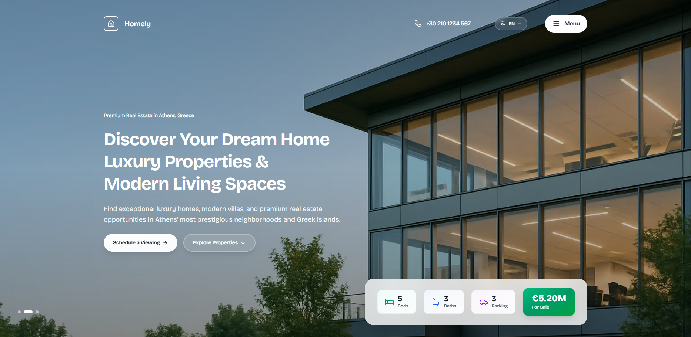

<div align="center">
  <h1>🏡 Spiti - Premium Real Estate</h1>
  <p><strong>Ανακαλύψτε το όνειρο σας με πολυτελή ακίνητα στην Αθήνα</strong></p>
  
  
  
  
  
  
</div>

<div align="center">
  
  <p><em>Desktop view του Spiti με hero carousel, glassmorphism design και premium property listings</em></p>
</div>

---

## ✨ Overview

**Spiti** είναι μια σύγχρονη, πολυτελής πλατφόρμα ακινήτων που φιλοδοξεί να μεταμορφώσει τον τρόπο με τον οποίο ανακαλύπτετε και επιλέγετε το σπίτι των ονείρων σας. Με εστίαση στην Αθήνα και τις ελληνικές νησιωτικές περιοχές, προσφέρουμε μια premium εμπειρία που συνδυάζει εντυπωσιακό σχεδιασμό με cutting-edge τεχνολογία.

### 🌟 Why Spiti?

- **🎨 Διαμορφωμένο σχεδιασμό**: Πρόσεξης λεπτομέρειας, σύγχρονη αισθητική
- **🌍 Πολυγλωσσικότητα**: Πλήρης υποστήριξη σε 4 γλώσσες (EN, ES, FR, EL)
- **📱 Προσαρμοστικότητα**: Απόλιστη λειτουργικότητα σε κάθε συσκευή
- **⚡ Ισχυρή απόδοση**: Βελτιστοποιημένη με τα πιο σύγχρονα εργαλεία
- **🎬 Κινούμενα γραφικά**: Ιστορικές κινήσεις με Framer Motion

---

## 🚀 Key Features

### 🎯 **Hero Section με Carousel**
- **Auto-rotating**: Αναδημοσίευση των hero images κάθε 5 δευτερόλεπτα
- **Εξατομικευμένο**: Ξεχωριστά desktop & mobile
- **Flow scroll**: Συνεχής scroll με το Lenis Smooth Scroll
- **Δυναμική τιμολόγηση**: Ανταλλάσσονται δεδομένα με τις εικόνες
- **Δείκτες προόδου**: Αλεξίπτωτα πλήρους προόδου με custom scrollbar

### 🎨 **Modern UI Components**
- **Header με Glassmorphism**: Ξεθώριασμα και διαφάνεια
- **Dropdown επιλογής γλώσσας**: Εύκολη εναλλαγή με σημαίες
- **Info Cards με διαβάθμιση**: Κάρτες διαφοροποιημένες με γράμματα, hover εφέ
- **Responsive grid**: Προσαρμοζόμενη διάταξη ανά συσκευή
- **Εξοικονόμηση κίνησης**: Κινούμενα στοιχεία με frame-by-frame κίνηση

### 🌐 **Internationalization**
- **Πλήρης μεταφρασιμότητα**: Όλα τα στοιχεία σε 4 γλώσσες
- **Δυναμική εναλλαγή**: Άμεση μετατροπή χωρίς reload
- **Επικοινωνιακό περιεχόμενο**: Μετάφραση σε EN, ES, FR, EL

### 📊 **Property Showcase**
- **Hero Info Table**: Κινητή πίνακας ιδιοτήτων
- **Property Listings**: Εκθέσεις ακινήτων με hover απεικονίσεις
- **Featured Properties**: Έμφαση σε premium ακίνητα
- **Category Filtering**: Κατηγοριοποίηση ανά τύπο (Villas, Apartments, Offices)

### 🎬 **Animations & Interactions**
- **Scroll Animations**: Εμφάνιση στοιχείων στη scroll
- **Hover Effects**: Εφέ επί των cards και buttons
- **Smooth Transitions**: Αναδιπλασιάσεις συστέλεψης
- **Number Animations**: Αριθμητικότητες με scale & fade

---

## 🛠️ Tech Stack

| Category | Technology | Version |
|----------|-----------|---------|
| **Framework** | Next.js | 16.0.0 |
| **UI Library** | React | 19.2.0 |
| **Language** | TypeScript | 5.x |
| **Styling** | Tailwind CSS | 4.x |
| **Animations** | Framer Motion | 12.23.24 |
| **Smooth Scroll** | Lenis | 1.3.13 |
| **Icons** | Lucide React | 0.547.0 |
| **Build Tool** | Turbo | Latest |

### 🔧 Additional Tools
- **ESLint** - Για ποιότητα κώδικα
- **PostCSS** - Για processing CSS
- **Bricolage Grotesque** - Προσαρμοσμένη γραμματοσειρά
- **Geist Fonts** - UI γραμματοσειρές από Vercel

---

## 📁 Project Structure

```
spiti-mou/
├── 📂 src/
│   ├── 📂 app/
│   │   ├── page.tsx           # 🎯 Main homepage (1500+ lines)
│   │   ├── layout.tsx         # Root layout with fonts
│   │   └── globals.css        # Global styles & animations
│   │
│   └── 📂 translations/
│       ├── en.json            # 🇬🇧 English translations
│       ├── es.json            # 🇪🇸 Spanish translations
│       ├── fr.json            # 🇫🇷 French translations
│       └── el.json            # 🇬🇷 Greek translations
│
├── 📂 public/
│   ├── hero_background3.png   # Desktop hero images
│   ├── hero_background4.png
│   ├── hero_background5.png
│   ├── hero_background_mobile*.png  # Mobile hero images
│   ├── house_*.png            # Property listing images
│   └── *.svg, *.avif          # Icons & optimized images
│
├── package.json               # Dependencies & scripts
├── next.config.ts             # Next.js configuration
├── tsconfig.json              # TypeScript settings
└── tailwind.config.js         # Tailwind configuration
```

---

## 🚀 Quick Start

### Prerequisites
```bash
Node.js >= 18.0.0
npm >= 9.0.0
```

### Installation

1. **Clone the repository**
```bash
git clone <repository-url>
cd Spiti-Mou
```

2. **Install dependencies**
```bash
npm install
```

3. **Run development server**
```bash
npm run dev
```

4. **Open in browser**
```
http://localhost:3000
```

### Production Build

```bash
# Build for production
npm run build

# Start production server
npm start
```

---

## 🎨 Design Highlights

### 🖼️ Hero Section
- **Full-screen carousel** με 3 premium backgrounds
- **Glassmorphism info cards** με gradient borders
- **Animated property stats** που αλλάζουν με το carousel
- **Custom scrollbar** με emerald gradient
- **Dark overlay** για καλύτερη readability

### 🎯 Header
- **Fixed navigation** με transparent → solid transition
- **Language selector** με dropdown + flags
- **Phone number display** (+30 210 1234 567)
- **Mobile hamburger menu** με fullscreen overlay
- **Responsive sizing** για όλα τα breakpoints

### 📊 Info Table
- **Color-coded cards**: Emerald (Beds), Blue (Baths), Purple (Parking)
- **Premium price card** με emerald gradient
- **Hover animations**: Scale, lift, glow effects
- **Mobile 2-row layout** vs Desktop single-row

### 🏘️ Property Listings
- **Grid layout**: 2-column desktop, 1-column mobile
- **Hover image zoom** με smooth transitions
- **Category badges**: Luxury Villas, Apartments, Offices
- **Responsive cards** με optimal image loading

---

## 🌍 Localization

Το **Spiti** υποστηρίζει πλήρη internationalization:

| Language | Code | Coverage |
|----------|------|----------|
| 🇬🇧 English | `en` | Complete |
| 🇪🇸 Español | `es` | Complete |
| 🇫🇷 Français | `fr` | Complete |
| 🇬🇷 Ελληνικά | `el` | Complete |

**Μεταφρασμένα elements:**
- Navigation menu
- Hero section (title, description, CTAs)
- Property details
- Footer content
- All UI labels

---

## 🎬 Animation System

### Framer Motion Animations
```typescript
// Hero Section
- Initial: fadeIn + slideUp
- Delay: staggered (0.5s, 0.7s, 1.2s)
- Duration: 0.8s with easing

// Hover Effects
- Buttons: scale(1.05) + y(-2px)
- Cards: y(-8px) + shadow increase
- Icons: color transitions

// Scroll Animations
- whileInView: fadeIn + slide
- Threshold: -100px
- Duration: 0.6-0.8s
```

### Lenis Smooth Scroll
```typescript
- Duration: 1.5s
- Easing: Custom cubic-bezier
- Wheel multiplier: 1
- Touch multiplier: 1.5
- Custom scrollbar with gradient
```

---

## 📱 Responsive Breakpoints

| Breakpoint | Width | Features |
|------------|-------|----------|
| **Mobile** | < 640px | Single column, compact nav, 2-row info |
| **Tablet** | 640px - 1024px | 2-column grid, expanded nav |
| **Desktop** | 1024px+ | Full layout, hero carousel, side nav |
| **Large** | 1280px+ | Optimized spacing, max-width containers |

---

## ⚡ Performance Optimizations

- **Next.js Image Optimization**: AVIF, WebP support
- **Code Splitting**: Dynamic imports
- **Lazy Loading**: Images below fold
- **Font Optimization**: Geist & Bricolage with display swap
- **CSS Optimization**: Tailwind purging
- **Smooth Scroll**: Hardware-accelerated with Lenis

---

## 🎯 Key Sections

### 1️⃣ **Header**
Fixed transparent header με logo, contact info, language selector

### 2️⃣ **Hero**
Full-screen carousel, animated text, info table, CTAs

### 3️⃣ **Categories**
Premium ακίνητα με category showcase

### 4️⃣ **Properties**
6 property listings με cards, hover effects, details

### 5️⃣ **Featured Property**
Highlight premium ακίνητο με large showcase

### 6️⃣ **Footer**
Newsletter, navigation, contact info, social links

---

## 🔥 Cool Features

### ✨ **Animated Info Table**
- Numbers που αλλάζουν με το carousel
- Smooth transitions με scale & fade
- Color-coded cards (Emerald, Blue, Purple)
- Premium gradient price display

### 🌐 **Glassmorphism Design**
- Translucent backgrounds
- Backdrop blur effects
- Border glows on hover
- Modern aesthetic

### 📸 **Image Carousel**
- 3 desktop + 3 mobile images
- Auto-rotate κάθε 5 seconds
- Fade transitions
- Indicator dots

### 🎨 **Custom Scrollbar**
- Emerald gradient
- Auto-hide μετά από 1s
- Smooth tracking
- Position indicator

---

## 🎓 Customization

### Changing Hero Images
```typescript
// In page.tsx, lines 47-58
const heroImages = [
  '/hero_background3.png',
  '/hero_background5.png',
  '/hero_background4.png'
];

const heroImagesMobile = [
  '/hero_background_mobile2.png',
  '/hero_background_mobile.png',
  '/hero_background_mobile3.png'
];
```

### Updating Property Data
```typescript
// In page.tsx, lines 61-65
const propertyData = [
  { beds: 4, baths: 4, parking: 2, price: '4.75M' },
  { beds: 5, baths: 3, parking: 3, price: '5.20M' },
  { beds: 6, baths: 5, parking: 4, price: '6.80M' }
];
```

### Adding Languages
1. Δημιουργήστε `src/translations/[code].json`
2. Προσθέστε στο `translations` object
3. Προσθέστε flag στο language selector

---

## 📝 Available Scripts

```bash
npm run dev          # Development server
npm run dev:webpack  # Dev with webpack (no turbo)
npm run build        # Production build
npm run start        # Start production server
npm run lint         # ESLint check
```

---

## 🌐 Deployment

### Vercel (Recommended)
```bash
# Install Vercel CLI
npm i -g vercel

# Deploy
vercel --prod
```

### Netlify
```bash
# Netlify will auto-detect Next.js
# Just connect your Git repository
```

### Docker
```dockerfile
FROM node:18-alpine
WORKDIR /app
COPY package*.json ./
RUN npm ci
COPY . .
RUN npm run build
CMD ["npm", "start"]
```

---

## 🎨 Color Palette

| Color | Usage | Hex |
|-------|-------|-----|
| Emerald Primary | Buttons, accents | #10b981 |
| Emerald Dark | Hover states | #059669 |
| Blue Secondary | Baths info | #3b82f6 |
| Purple Accent | Parking info | #a855f7 |
| Gray Text | Body text | #171717 |
| White Overlay | Glassmorphism | rgba(255,255,255,0.8) |

---

## 📊 Site Statistics

- **Total Lines**: 1,500+
- **Components**: 50+ animated elements
- **Images**: 12+ optimized images
- **Languages**: 4 supported
- **Properties**: 6 showcased
- **Animations**: 30+ unique transitions

---

## 🚧 Roadmap

- [ ] **Property Search** - Advanced filtering
- [ ] **Contact Form** - Email integration
- [ ] **Virtual Tours** - 360° property views
- [ ] **User Authentication** - Saved searches
- [ ] **Payment Gateway** - Online deposits
- [ ] **Booking System** - Viewing appointments
- [ ] **Map Integration** - Google Maps locations
- [ ] **Blog Section** - Real estate insights

---

## 🤝 Contributing

Contributions welcome! Παρακαλώ:

1. Fork το repository
2. Δημιουργήστε feature branch (`git checkout -b feature/AmazingFeature`)
3. Commit με descriptive messages (`git commit -m 'Add some AmazingFeature'`)
4. Push στο branch (`git push origin feature/AmazingFeature`)
5. Ανοίξτε Pull Request

---

## 📄 License

© 2025 **Spiti** - Design & Developed by **Elio Dev**

Αυτό το project είναι private και προστατεύεται από copyright.

---

## 💡 Special Thanks

- **Next.js Team** - Καταπληκτικό framework
- **Vercel** - Σύγχρονα deployment solutions
- **Tailwind CSS** - Utility-first CSS revolution
- **Framer Motion** - Μεγάλη βιβλιοθήκη animations
- **All Contributors** - Για τις valuable suggestions

---

<div align="center">

### 🌟 Made with ❤️ using Next.js, React & Modern Web Technologies

**Ξεκινήστε το ταξίδι σας για το σπίτι των ονείρων σας τώρα!**

[🚀 Live Demo](#) | [📖 Documentation](#) | [🐛 Report Bug](#) | [💡 Request Feature](#)

</div>
